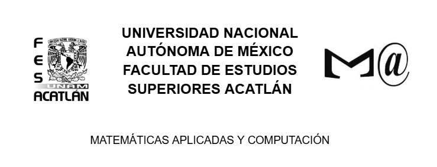
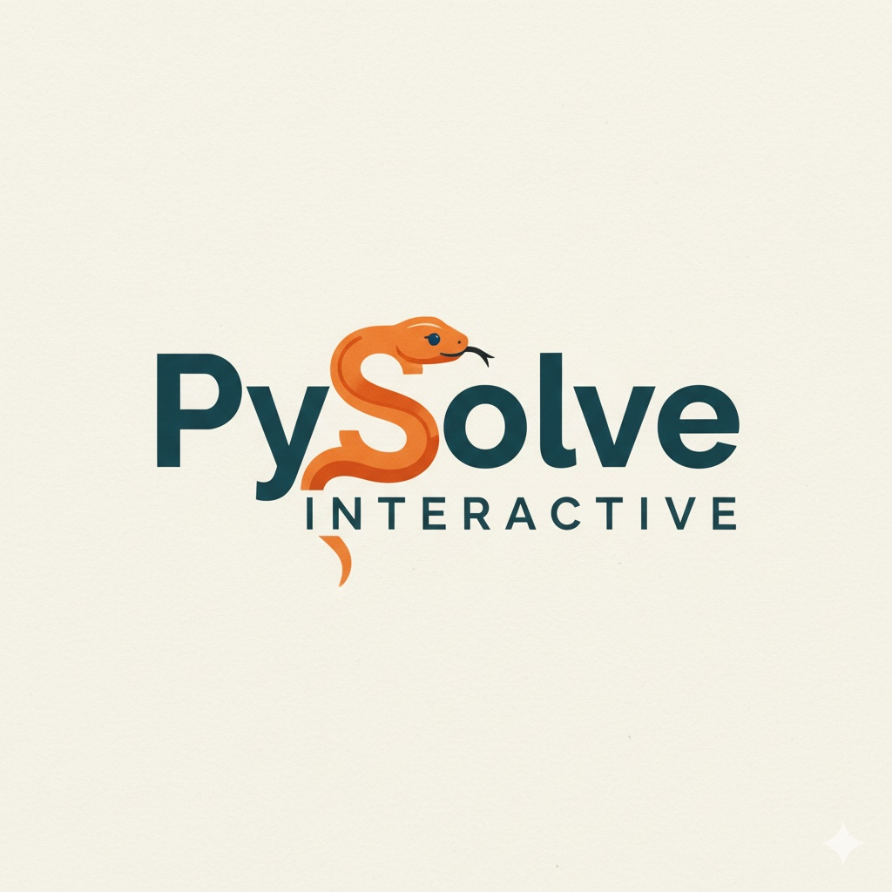

# Manual del Aplicativo: PySolve Interactive

<!--toc:start-->
-   [Guía del proyecto](#guía-del-proyecto)
    -   [Introducción](#introducción)
        -   [Objetivo](#objetivo)
        -   [Prerrequisitos](#prerrequisitos)
        -   [Stack](#stack)
    -   [Contenido](#contenido)
    -   [Detalles](#detalles)
    -   [Autores](#autores)
    -   [Créditos](#créditos)

<!--toc:end-->

## Introducción

Este proyecto consiste en un **aplicativo visual desarrollado en
Python** que permite ejecutar y visualizar algunos de los principales
**Métodos Numéricos** utilizados en cursos de ingeniería, matemáticas y
ciencias computacionales.

El sistema ofrece una interfaz gráfica, donde el usuario puede explorar y conocer brevemente
cada método, introducir valores, observar los cálculos realizados y
obtener las soluciones generadas paso a paso.

> [!NOTE]
> Este proyecto está orientado a estudiantes o personas que
> desean comprender mejor el funcionamiento práctico de los métodos
> numéricos.\
> No busca lograr un rendimiento de producción, sino ofrecer un enfoque
> didáctico y comprensible.

### Objetivo

El **propósito** principal es crear una herramienta educativa e interactiva
que refuerce los conceptos teóricos mediante la visualización y
experimentación directa.

### Prerrequisitos

Para ejecutar este proyecto, asegúrese de contar con:

-   Una instalación funcional de **Python** (recomendado: Python 3.10+).
-   Algún entorno o IDE para correr el proyecto, por ejemplo:
    -   **Visual Studio Code**
    -   **Spyder (Anaconda)**
    -   **Anaconda Navigator**
-   `pip` configurado correctamente.
-   Módulos necesarios:

    -   `Tkinter` → utilizado para la interfaz gráfica

    -   `pygame` → utilizado para la reproducción de audio


        Instalación desde la terminal (cmd, bash, PowerShell, etc):

        ``` bash
        pip install pygame
        ```

    -   Módulo integrado `os.path`, encargado de manejar rutas según el
        sistema operativo.
-   Archivo de música incluido en el proyecto, necesario para la
    reproducción de audio dentro del aplicativo.

### Stack

Este proyecto utiliza:

-   `Python` (recomendado 3.10+)
-   `pygame` para la interfaz gráfica
-   Implementaciones manuales de algoritmos numéricos
-   Conceptos clave como:
    -   Métodos para resolver ecuaciones no lineales (Falsa Posición, Secante,
        Newton)
    -   Métodos para resolver sistemas de ecuaciones lineales (Gauss, Jacobi, Gauss-Seidel)
    -   Técnicas iterativas y de aproximación
    -   Factorización LU (Doolittle, Cholesky)
    -   Valores y Vectores Propios (Potencia, Potencia Inversa)

## Contenido

Este repositorio incluye:

-   **Aplicación Principal**\
    Archivo de Python `main.py` que inicia la interfaz visual donde se despliegan los
    métodos numéricos.

    **Basta con ejecutar este archivo para la visualización e interacción.**

-   **Carpeta de Métodos Numéricos (Methods)**\
    Implementaciones de algoritmos tales como:

    -   Método de Falsa Posición
    -   Método de la Secante
    -   Método de Newton
    -   Método de Gauss
    -   Método de Jacobi
    -   Método de Gauss-Seidel
    -   Método de Doolittle
    -   Método de Cholesky
    -   Método de la Potencia
    -   Método de la Potencia Inversa
 
-   **Carpeta de Ventanas para la Interfaz Gráfica (GraphicInterface)**\
    Implementaciones de las ventanas gráficas para cada método:

    -   Ventana de Falsa Posición
    -   Ventana de la Secante
    -   Ventana de Newton
    -   Ventana de Gauss
    -   Ventana de Jacobi
    -   Ventana de Gauss-Seidel
    -   Ventana de Doolittle
    -   Ventana de Cholesky
    -   Ventana de la Potencia
    -   Ventana de la Potencia Inversa

-   **Carpeta de Recursos (Assets)**

    -   Archivo de música utilizado por la interfaz
    -   Imágenes o íconos adicionales si se requieren

-   **Manual (README.md)**\
    Archivo `README.md` (documentación) con explicaciones, notas y estructura interna del
    proyecto.

## Detalles

Este proyecto forma parte de un esfuerzo académico para desarrollar una
herramienta funcional que permita aprender métodos numéricos
mediante visualización e interacción.

Si desea sugerir mejoras, añadir nuevos métodos, optimizar la interfaz
o integrar animaciones para mostrar los pasos iterativos, estaremos
encantados de ayudarle.

> [!TIP] 
> Puedes ampliar el proyecto incorporando nuevos algoritmos,
> añadiendo menús, mejorando la interfaz u optimizando el código utilizado.

- Se ha trabajado este proyecto de manera colaborativa utilizando herramientas como git y GitHub para un mejor desarrollo.

  *Se puede acceder a él a través de:* [PySolve Interactive](https://github.com/DianaHang/Proyecto-Metodos-Numericos)

## Autores

-   García Melgarejo Diana Karina.
-   Jacobo Santos Marco Antonio.
-   Segoviano Salinas Eduardo.

## Créditos

<table border="0" cellspacing="10" cellpadding="10">
  <tr>
    <td align="center" valign="top">
      
    </td>
    <td align="center" valign="top">
      
    </td>

Hecho en México por estudiantes de la UNAM, todos los derechos reservados 2025. ©
